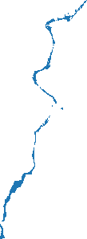
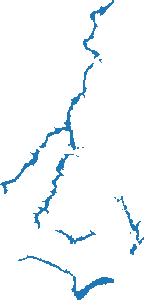
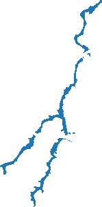

## Building Docker Images

```
cd docker
docker-compose build
```

## Running the FIM Docker Container

```
python src/fimbox.py
```

The CLI walks you through selecting a mode (currently `HAND-FIM`), then lets
you choose between two ways of providing input:

1. **Manual entry** — interactively type in a single HUC-8 code, one or more
   NWM reach IDs, and matching flow rates (cms).
2. **Scenario JSON file** — point the CLI at a JSON file describing one or
   more scenarios (see [`schema/schema.md`](schema/schema.md) and
   [`schema/schema.json`](schema/schema.json) for the full format). Each
   scenario is validated against the schema, then produces a single combined
   output GeoTIFF, even if it spans multiple reaches or multiple HUCs.

In both cases, the tool creates `./input` and `./output` directories in your
current working directory, mounts them into the container, and streams the
FIM computation progress to the terminal in real time. Final results are
written to `./output/scenarios/<ScenarioID>.tif` (JSON mode) or
`./output/flood_<HUC>/...` (manual mode).

### Example: scenario JSON files

Sample scenario files are provided in [`test-data/`](test-data/). When
prompted for "Path to scenario JSON file", enter the path to one of these
(or your own file following the same schema):

#### `test-data/single_reach.json` — one scenario, one reach

A single scenario made up of one reach in one HUC. Produces one output
GeoTIFF for the scenario.

```json
[
  {
    "ScenarioID": "single-reach-scenario",
    "Reaches": [
      { "HUC": "03020201", "ReachID": "8780625", "Streamflow": 227 }
    ]
  }
]
```

`./output/scenarios/single-reach-scenario.tif`:



#### `test-data/single_huc_many_reaches.json` — one scenario, many reaches, one HUC

Multiple reaches within the same HUC are combined into a single flow input
file, producing one merged output GeoTIFF for the scenario.

```json
[
  {
    "ScenarioID": "single-huc-senario",
    "Reaches": [
      { "HUC": "03020201", "ReachID": "8780625", "Streamflow": 233 },
      { "HUC": "03020201", "ReachID": "8780659", "Streamflow": 224 },
      { "HUC": "03020201", "ReachID": "8780641", "Streamflow": 239 },
      { "HUC": "03020201", "ReachID": "8780645", "Streamflow": 223 }
    ]
  }
]
```

`./output/scenarios/single-huc-senario.tif`:


#### `test-data/many_hucs_many_reaches.json` — one scenario, many reaches, many HUCs

Reaches spanning multiple HUCs are computed per-HUC, then merged into a
single combined output GeoTIFF for the scenario.

```json
[
  {
    "ScenarioID": "multiple-huc-scenario",
    "Reaches": [
      { "HUC": "03020201", "ReachID": "8780625", "Streamflow": 223 },
      { "HUC": "03020201", "ReachID": "8780659", "Streamflow": 229 },
      { "HUC": "03020201", "ReachID": "8780641", "Streamflow": 231 },
      { "HUC": "03020201", "ReachID": "8780645", "Streamflow": 225 },
      { "HUC": "03030002", "ReachID": "8891104", "Streamflow": 227 },
      { "HUC": "03030002", "ReachID": "8891054", "Streamflow": 240 },
      { "HUC": "03030002", "ReachID": "8891166", "Streamflow": 227 },
      { "HUC": "03030002", "ReachID": "8891174", "Streamflow": 226 }
    ]
  }
]
```

`./output/scenarios/multiple-huc-scenario.tif`:



#### `test-data/multiple_scenarios.json` — many scenarios in one file

Each entry in the top-level list is its own independent scenario; every
scenario produces its own output GeoTIFF. This is useful for running a
batch of related scenarios (e.g. steps of a hydrograph) in one job.

```json
[
  {
    "ScenarioID": "scenario1",
    "Reaches": [
      { "HUC": "03020201", "ReachID": "8780625", "Streamflow": 223 },
      { "HUC": "03020201", "ReachID": "8780659", "Streamflow": 224 },
      { "HUC": "03020201", "ReachID": "8780641", "Streamflow": 228 },
      { "HUC": "03020201", "ReachID": "8780645", "Streamflow": 227 }
    ]
  },
  {
    "ScenarioID": "scenario2",
    "Reaches": [
      { "HUC": "03020201", "ReachID": "8780625", "Streamflow": 222 },
      { "HUC": "03020201", "ReachID": "8780659", "Streamflow": 224 },
      { "HUC": "03020201", "ReachID": "8780641", "Streamflow": 236 },
      { "HUC": "03020201", "ReachID": "8780645", "Streamflow": 235 }
    ]
  }
]
```

`./output/scenarios/scenario1.tif` and `./output/scenarios/scenario2.tif`:

 
